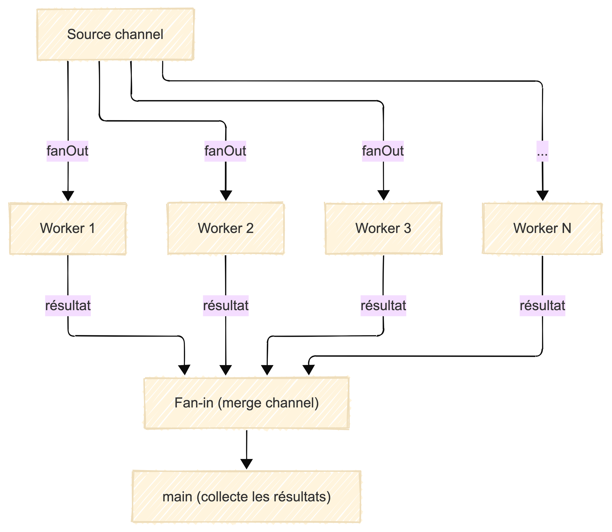

# Fan-out / Fan-in en Go

Ce dossier illustre le pattern fan-out/fan-in en Go, utilisé pour paralléliser le traitement de données et agréger les résultats.

## Principe

- **Fan-out** : Un producteur (main) distribue des tâches à plusieurs workers (goroutines) via un canal.
- **Fan-in** : Les workers traitent les tâches en parallèle et envoient leurs résultats sur un canal de sortie, qui est ensuite consommé pour agréger les résultats.

## Exemple d'utilisation

```go
jobs := make(chan int)
results := make(chan int)

// Fan-out : démarrer plusieurs workers
for w := 0; w < 3; w++ {
    go worker(w, jobs, results)
}

// Envoyer des jobs
for j := 1; j <= 5; j++ {
    jobs <- j
}
close(jobs)

// Fan-in : collecter les résultats
for a := 1; a <= 5; a++ {
    fmt.Println(<-results)
}
```

## Schéma de fonctionnement




## Avantages
- Parallélisme simple et efficace
- Bonne utilisation des ressources CPU
- Facile à adapter au nombre de workers

## Limites
- Nécessite de bien gérer la synchronisation et la fermeture des canaux
- Les jobs doivent être indépendants
