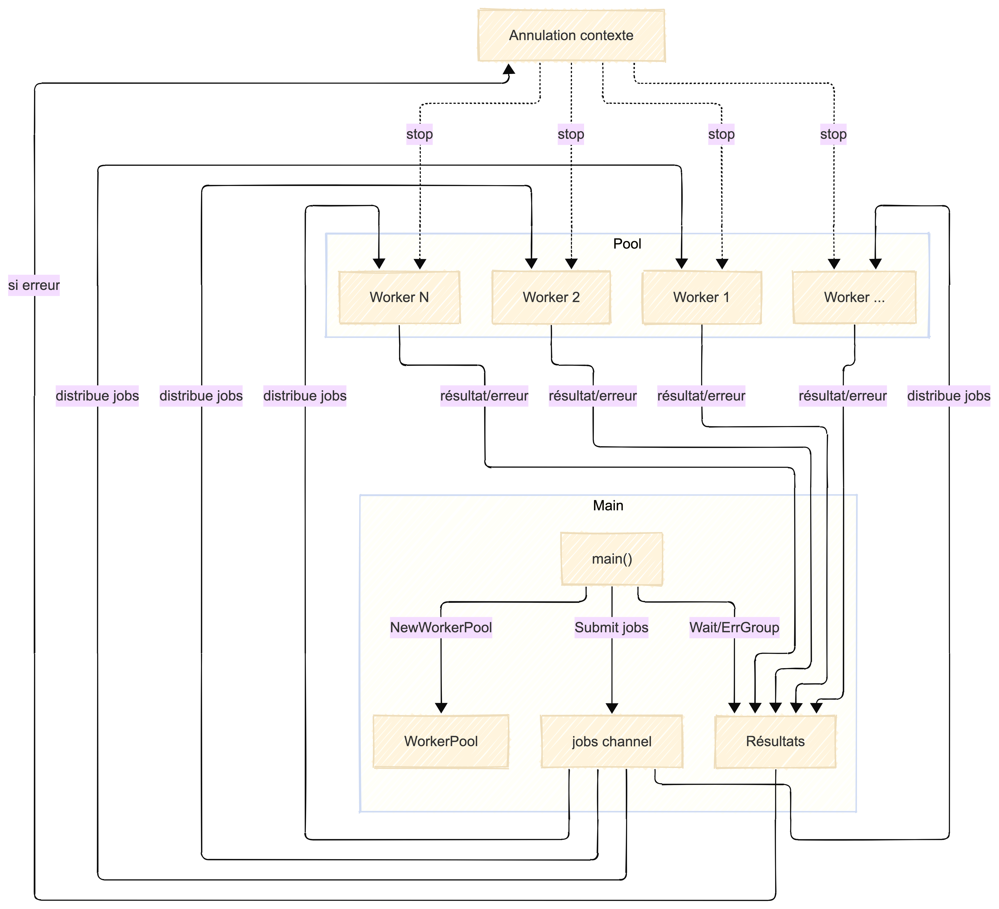
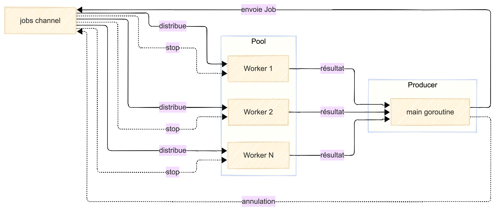

# Worker Pool en Go

Ce dossier présente une implémentation de worker pool générique en Go, permettant de traiter des jobs en parallèle avec gestion du contexte et des erreurs.

## Principe

- Plusieurs workers (goroutines) écoutent sur un canal de jobs partagé.
- Les jobs sont soumis dans le canal et dispatchés automatiquement aux workers disponibles.
- Chaque worker traite un job, renvoie le résultat, puis attend le suivant.
- Le contexte permet d'annuler tous les jobs en cours en cas d'erreur ou sur demande.

## Exemple d'utilisation

```go
pool := NewWorkerPool(5, func(ctx context.Context, x int) (int, error) {
	time.Sleep(100 * time.Millisecond)
	if x == 5 {
		return 0, fmt.Errorf("error processing item %d", x)
	}
	return x * 2, nil
})

g, ctx := errgroup.WithContext(context.Background())
pool.Start(ctx)
results := make([]int, 10)
for i := 0; i < 10; i++ {
	i := i
	g.Go(func() error {
		result, err := pool.Submit(ctx, i)
		if err != nil {
			return err
		}
		results[i] = result
		return nil
	})
}
if err := g.Wait(); err != nil {
	fmt.Println("At least one error occurred:", err)
}
```

## Schéma de fonctionnement avec contexte partagé



## Schéma de fonctionnement simplifié



## Avantages

- Parallélisme contrôlé et efficace.
- Gestion centralisée des erreurs et de l'annulation.
- Adapté aux traitements intensifs ou I/O bound.

## Limites

- Les jobs déjà dans le canal peuvent être traités même après annulation.
- Nécessite de bien gérer la synchronisation et la fermeture des canaux.
