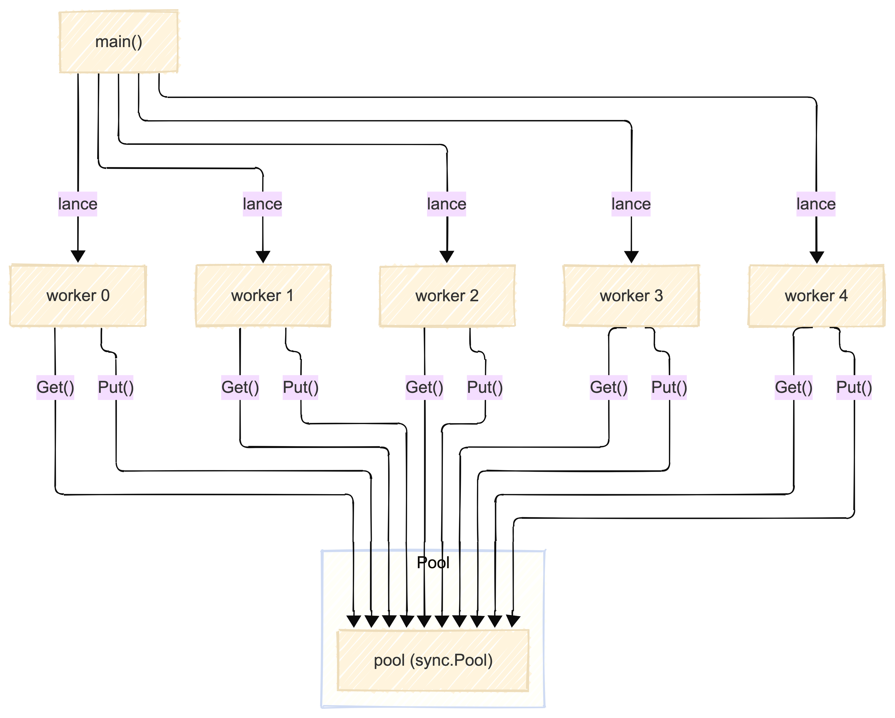

# Pooling avec sync.Pool en Go

Ce dossier montre comment utiliser `sync.Pool` pour réutiliser efficacement des objets (ici, des buffers mémoire) entre plusieurs goroutines (workers).

## Principe

- `sync.Pool` permet de stocker et de réutiliser des objets coûteux à créer, afin de limiter les allocations et améliorer les performances en environnement concurrent.
- Chaque worker récupère un objet du pool (`Get()`), l'utilise, puis le remet dans le pool (`Put()`).
- Si le pool est vide, il crée un nouvel objet via la fonction `New`.

## Exemple

```go
var pool = sync.Pool{
	New: func() interface{} {
		return &bytes.Buffer{}
	},
}

func worker(id int, wg *sync.WaitGroup) {
	defer wg.Done()
	buf := pool.Get().(*bytes.Buffer)
	buf.WriteString(fmt.Sprintf("worker %d\n", id))
	fmt.Print(buf.String())
	buf.Reset()
	pool.Put(buf)
}
```

## Schéma de fonctionnement



## Avantages

- Réduction des allocations mémoire.
- Réutilisation efficace des objets.
- Idéal pour les applications concurrentes à haute performance.

## Limites

- Les objets dans le pool peuvent être supprimés à tout moment par le garbage collector.
- Ne pas utiliser pour partager des objets avec un état important ou non réinitialisé.
Ce fichier montre l’utilisation de sync.Pool pour réutiliser des buffers mémoire entre plusieurs goroutines (workers) :
